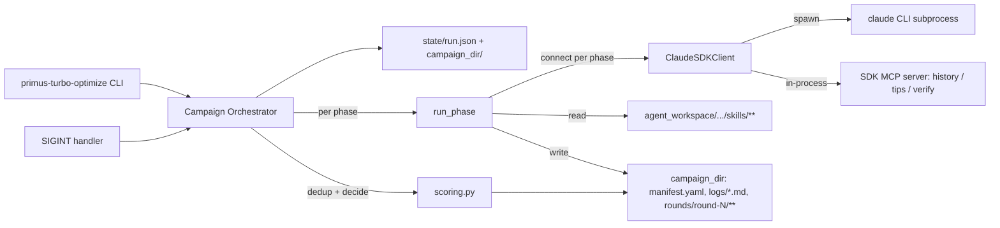
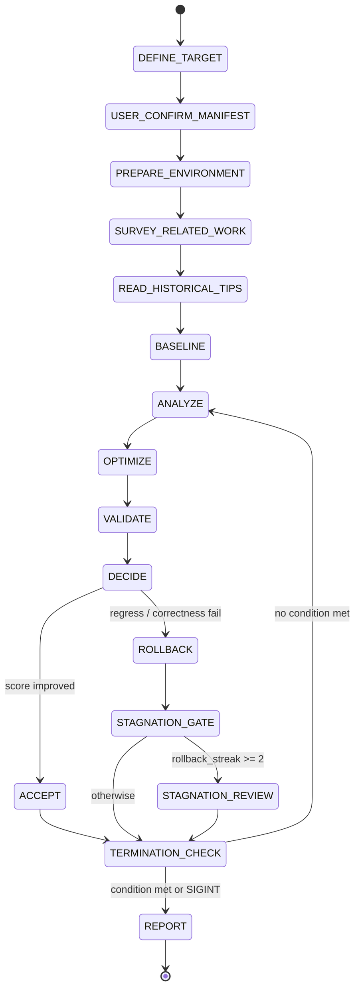

# primus-turbo-optimize CLI 与 kernel-optimize 循环驱动设计

## 目标

将 `agent_workspace/Primus-Turbo/agent/skills/kernel-optimize/SKILL.md` 定义的完整优化循环改造成一个 Python CLI 驱动的长时间无人值守任务：

- 命令：`primus-turbo-optimize -p "optimize gemm fp8 blockwise kernel with triton backend"`，或 `-s <campaign_id>` 恢复历史任务。
- 在 DEFINE_TARGET 结束、生成 `manifest.yaml` 草稿之后触发一次用户确认；随后循环完全无人值守。
- 容器内长跑，只接 `Ctrl+C` (`SIGINT`) 作为用户终止信号。
- 循环按 SKILL 规范执行，不同阶段拆分为独立 skill / sub-agent 被调用。
- 主程序与阶段之间用 JSON 文件做 IPC，阶段之间用 JSON / Markdown 做控制流。
- 知识库（历史 tips）、profile、精度验证以本地 MCP 工具形式暴露给 Claude。

## 关键决策

- **编排方式：方案 a（Python 驱动 + 每 phase 独立 `ClaudeSDKClient`）**。骨架预留 `agents=` 扩展口，日后可把单个 phase 升级为方案 c（phase 内 sub-agent 并发）。
- **MCP 形态：v1 采用 in-process SDK MCP server**（`create_sdk_mcp_server`），只服务主循环。当出现"用户手动 Claude Code 会话也要查同一份知识库"时再升级为独立 stdio MCP。
- **鉴权：沿用 `turbo_optimize/model_connnector/claude_code_connector.py` 的 `load_auth_from_env`**，从 `ANTHROPIC_BASE_URL` / `ANTHROPIC_AUTH_TOKEN` / `ANTHROPIC_API_KEY` 读取。
- **权限模式：全局 `permission_mode="bypassPermissions"`**，每 phase 用 `allowed_tools` 白名单收紧；唯一人工交互点是 manifest 确认。

## 选型依据

### 编排方式：为什么选 a 而不是 b / c

| 维度 | a) Python 编排 | b) 单长会话 + sub-agents | c) 混合（phase 内 sub-agent） |
|---|---|---|---|
| 循环驱动 | Python | 主 Claude | Python |
| ACCEPT / ROLLBACK / termination 决策 | Python 读 CSV + 阈值 | Claude 读 summary + 推理 | Python |
| 上下文消耗 | 低（每 phase 重置） | 高（随 round 累积，30+ 轮可能溢出） | 低 |
| 故障恢复 | phase 粒度重跑 | 只能整 session resume | phase 粒度重跑 |
| phase 内并行 | 无 | 有 | 有（按 phase 配置） |
| 规则遵循确定性 | 高（规则写进 Python） | 中（依赖 Claude 每轮记得对表） | 高 |
| 观测 / 审计 | 每 phase 独立日志 | 混合流，靠 `agent_id` 区分 | 每 phase 独立日志 |
| 实现复杂度 | 中 | 低（但回放调试最难） | 高 |
| 长时无人值守稳定性 | 最好 | 差（长 session + 幻觉积累） | 好 |

容器内长时间运行 + 只接 Ctrl+C + 除 manifest 外不确认的约束下，a 的确定性收益最大；c 只在少数 phase（SURVEY / ANALYZE）有并发红利。v1 默认 a，`run_phase` 骨架预留 `agents=` 参数，后续按需升级。

### 历史遗忘担忧的解答

方案 a/c 每 phase 切换 `ClaudeSDKClient` 不会导致历史丢失，因为 SKILL 本身按"文件即记忆"设计：

- `<campaign_dir>/logs/optimize.md`（含 Optimization History / Verified Ineffective Directions / Directions to Try / Current Best），append-only。
- `<campaign_dir>/logs/performance_trend.md`，append-only 的趋势表。
- `<campaign_dir>/rounds/round-N/summary.md` + `kernel_snapshot/`。
- `agent/historical_experience/<gpu>/<op>/<backend>/tips.md`（跨 campaign）。

iteration_rules.mdc Rule 7 强制 rollback 之后写 Rollback Analysis / Root cause / Lesson learned，正是为了让下一轮能机械读取。方案 b 在 30+ 轮时也必须靠文件回溯（auto-compact 会摘要丢细节），没有额外记忆优势。

a/c 的"反遗忘"三层防护：

1. **prompt 显式注入**：Python 从 `optimize.md` 结构化抽取 `verified_ineffective / directions_to_try / current_best / history`，写进 ANALYZE 的 prompt 模板，Claude 无法漏看。
2. **Python dedup 校验**：ANALYZE 输出 hypothesis JSON 后，`scoring.check_hypothesis_duplicate` 与 verified_ineffective 比对，重复就追加 prompt 重试，最多 2 次后走 stagnation_review。
3. **MCP 结构化查询**：`list_ineffective_directions` / `query_trend` / `read_best_summary` / `query_tips` 作为工具暴露，Claude 按需调用拿结构化结果，比 markdown 解析更稳。

### MCP 形态：为什么选 in-process

- 容器内单进程单任务，in-process 工具与主循环共享 Python 对象（`campaign_dir` 路径、配置）最省事。
- 数据本体仍然落盘（`campaign_dir/` 与 `agent/historical_experience/**`），进程重启不丢。
- 当需要"用户另开 Claude Code 交互式会话也能调同一批工具"时，把 `turbo_optimize/mcp/*.py` 抽出做独立 `python -m turbo_optimize.mcp.stdio` 入口，工具签名不变。

## 架构总览



## 目录布局

```
primus-turbo-auto-optimizer/
├── pyproject.toml                          console_scripts: primus-turbo-optimize
├── turbo_optimize/
│   ├── __init__.py
│   ├── __main__.py
│   ├── cli.py                              argparse + 入口
│   ├── config.py                           CampaignParams dataclass
│   ├── manifest.py                         manifest.yaml 读写 + 用户确认
│   ├── state.py                            state/run.json + phase_result/*.json
│   ├── logs.py                             append-only 写入 + 结构化历史抽取
│   ├── scoring.py                          CSV 解析 + geomean + accept/rollback 决策
│   ├── signals.py                          SIGINT → stop flag
│   ├── skills.py                           load_skill_section(path, section)
│   ├── model_connnector/
│   │   └── claude_code_connector.py        已实现，复用
│   ├── orchestrator/
│   │   ├── run_phase.py                    phase 执行骨架
│   │   ├── campaign.py                     主循环
│   │   └── phases/
│   │       ├── define_target.py
│   │       ├── prepare_environment.py
│   │       ├── survey_related_work.py
│   │       ├── read_historical_tips.py
│   │       ├── baseline.py
│   │       ├── analyze.py
│   │       ├── optimize.py
│   │       ├── validate.py
│   │       ├── stagnation_review.py
│   │       └── report.py
│   ├── mcp/
│   │   ├── __init__.py                     build_in_process_server()
│   │   ├── history.py                      list_ineffective_directions / query_trend / read_best_summary
│   │   ├── tips.py                         query_tips / append_tip
│   │   └── verification.py                 run_quick_validation / parse_bench_csv
│   └── prompts/                            phase prompt 模板（.md，f-string 填充）
│       ├── define_target.md
│       ├── prepare_environment.md
│       ├── survey_related_work.md
│       ├── baseline.md
│       ├── analyze.md
│       ├── optimize.md
│       ├── validate.md
│       └── report.md
└── state/                                  运行时，非版本化
    ├── run.json                            active campaign / phase / round
    └── phase_result/<phase>.json           每 phase 的结构化输出
```

## CLI 合约

入口：`primus-turbo-optimize`（`pyproject.toml` 的 `[project.scripts]` 注册）。

| 选项 | 说明 |
|---|---|
| `-p, --prompt <text>` | 自然语言优化目标；开新 campaign 必填 |
| `-s, --campaign <id>` | 恢复已存在的 campaign；值是 campaign 目录名，如 `gemm_fp8_blockwise_triton_gfx942_20260412` |
| `--skills-root <path>` | 默认 `agent_workspace/Primus-Turbo/agent` |
| `--project-skill <name>` | 默认 `primus-turbo-develop` |
| `--workspace-root <path>` | 默认 `agent_workspace/Primus-Turbo`，传给 `ClaudeAgentOptions.cwd` |
| `--max-iterations <N>` | 覆盖 manifest，`< 120` |
| `--max-duration <"Nh"/"Nm">` | 覆盖 manifest |
| `--dry-run` | 只打印 phase plan，不连 Claude |

- `-p` 与 `-s` 互斥：`-p` 开新 campaign；`-s` 恢复旧 campaign 并从对应目录读 `manifest.yaml` 作为参数源。
- `-s` 的值是 "campaign id"（目录名），不是 Claude SDK 的 `session_id`。方案 a 下每 phase 换一次 SDK session，campaign 级"记忆"落在 `campaign_dir/` 与 `state/run.json`。

## 循环状态机



## IPC 合约

### `state/run.json`

Python 在每个 phase 完成后更新：

```json
{
  "campaign_id": "gemm_fp8_blockwise_triton_gfx942_20260412",
  "campaign_dir": "agent_workspace/Primus-Turbo/agent/workspace/gemm_fp8_blockwise_triton_gfx942_20260412",
  "params": {
    "target_op": "gemm_fp8_blockwise",
    "target_backend": "TRITON",
    "target_gpu": "gfx942",
    "execution_mode": "repo",
    "primary_metric": "Forward TFLOPS",
    "git_commit": true,
    "git_branch": "optimize/gemm_fp8_blockwise_triton_gfx942_20260412",
    "max_iterations": null,
    "max_duration": null
  },
  "current_phase": "ANALYZE",
  "current_round": 4,
  "best_round": 3,
  "best_score": {"Forward TFLOPS": 318.6},
  "rollback_streak": 0,
  "started_at": "2026-04-20 09:14",
  "last_update": "2026-04-20 12:37"
}
```

### `state/phase_result/<phase>.json`

每个 phase 的结构化输出。phase prompt 最后一步强制 Claude 用 `Write` 工具写入该路径。示例（ANALYZE）：

```json
{
  "primary_hypothesis": "increase num_stages from 2 to 3 to hide global load latency",
  "bottleneck_class": "memory_bound",
  "expected_benefit": "+5% geomean on representative shapes",
  "risks": ["register pressure may rise, lowering occupancy"],
  "verification_signal": "rocprof vmem_read_stall_rate should drop",
  "rejected_alternatives": [
    {"direction": "switch to MFMA 32x32", "reason": "tried in round-3, regressed"}
  ]
}
```

### `campaign_dir/`

按 `agent_workspace/Primus-Turbo/agent/skills/kernel-optimize/SKILL.md` 第 152-170 行规范：

```
agent/workspace/<campaign_name>/
├── logs/
│   ├── optimize.md             append-only 主日志
│   └── performance_trend.md    append-only 趋势表
├── profiles/
├── related_work.md
├── rounds/
│   ├── round-1/                baseline
│   │   ├── summary.md
│   │   ├── kernel_snapshot/
│   │   └── artifacts/
│   └── round-N/
│       ├── summary.md
│       ├── kernel_snapshot/
│       └── artifacts/
├── manifest.yaml
└── quick_test_bench.py
```

### 恢复语义

`-s <campaign>` 启动时，Python 从 `state/run.json.current_phase` 对应位点继续。若停在 round 中途：

| current_phase | 恢复动作 |
|---|---|
| ANALYZE | 原地重跑 ANALYZE（幂等：只会覆盖 `state/phase_result/analyze_N.json`） |
| OPTIMIZE | 回滚该 round 未提交的 edit，回到 ANALYZE |
| VALIDATE | 若已完成 benchmark，读 artifacts 直接走 DECIDE；否则重跑 VALIDATE |
| ACCEPTED / ROLLBACK | 进入下一 round 的 ANALYZE |

## `run_phase` 骨架

```python
# turbo_optimize/orchestrator/run_phase.py
async def run_phase(
    phase: str,
    *,
    campaign_dir: Path,
    params: CampaignParams,
    prompt_vars: dict,
    allowed_tools: list[str],
    mcp_servers: dict | None = None,
    agents: dict | None = None,          # v1 始终 None；升级 c 时填 AgentDefinition 集合
    extra_tools: list[str] = (),         # c 方案下开 ["Task"]
    expected_output: Path | None = None, # phase 结束后 Python 读并校验
    max_turns: int | None = None,
) -> dict:
    system_prompt = load_skill_section(phase)
    options = ClaudeAgentOptions(
        system_prompt=system_prompt,
        allowed_tools=list(allowed_tools) + list(extra_tools),
        permission_mode="bypassPermissions",
        cwd=str(params.workspace_root),
        mcp_servers=mcp_servers or {},
        agents=agents,
        max_turns=max_turns,
    )
    async with ClaudeCodeConnector(options=options) as conn:
        rendered = render_prompt(phase, prompt_vars)
        async for msg in conn.ask(rendered):
            record_phase_message(phase, msg)
            if stop_requested():
                await conn._client.interrupt()
                raise GracefulStop()
    return load_phase_output(phase, expected_output)
```

每 phase 的 `allowed_tools` 白名单示例：

| phase | allowed_tools |
|---|---|
| DEFINE_TARGET | `["Read", "Write"]` |
| PREPARE_ENVIRONMENT | `["Read", "Write", "Bash(git:*)"]` |
| SURVEY_RELATED_WORK | `["WebFetch", "WebSearch", "Read", "Write", "Bash(git:clone)"]` |
| READ_HISTORICAL_TIPS | `["Read"]` + MCP `query_tips` |
| BASELINE | `["Read", "Write", "Bash"]` + MCP `run_quick_validation` / `parse_bench_csv` |
| ANALYZE | `["Read", "Bash(rocprof:*)"]` + MCP history / tips 全套 |
| OPTIMIZE | `["Read", "Edit", "Bash(git:*)"]` |
| VALIDATE | `["Bash", "Read", "Write"]` + MCP verification |
| STAGNATION_REVIEW | 同 ANALYZE |
| REPORT | `["Read", "Write"]` |

## ACCEPT / ROLLBACK 决策

决策完全由 Python 执行，严格对齐 `agent_workspace/Primus-Turbo/agent/skills/kernel-optimize/workflow/optimize-loop.md` 第 121-171 行与 `agent_workspace/Primus-Turbo/agent/rules/iteration_rules.mdc` 第 68-93 行：

- 硬门：build 失败 / 任一 `Check=FAIL` / aggregate score 回退 / 核心 shape 回退 > 3% → ROLLBACK。
- 通过门：aggregate score 不低于当前最佳，至少一个 metric 改善。
- 噪声复测：改善 < 2% 触发 VALIDATE phase 再测 3 次，计算均值/标准差，均值改善 > 1% 且 stdev < 改善幅度一半才接受。
- ACCEPT 成功：写 `rounds/round-N/summary.md` 的 `## Decision` 段、append 一行到 `logs/performance_trend.md`、append 一条到 `logs/optimize.md` Optimization History。
- ROLLBACK：拷贝 `rounds/round-(best_round)/kernel_snapshot/` 覆盖当前工作目录、写 `rounds/round-N/summary.md` Rollback Analysis 段、append 到 `logs/optimize.md` Verified Ineffective Directions 表。
- Git：若 `manifest.git_commit=true` 且决策为 ACCEPT，Python 调 `git commit`，message 模板见 optimize-loop.md 第 378-396 行。

## 历史注入与幻觉防护

进入 ANALYZE phase 之前 Python 先执行：

```python
history = logs.extract_history(campaign_dir)
# history = {
#   "current_best": {"round": 3, "score": {"Forward TFLOPS": 318.6}},
#   "history_rows": [...],              # performance_trend.md 解析
#   "verified_ineffective": [...],       # Verified Ineffective Directions 表
#   "directions_to_try": [...],          # Directions to Try 列表
#   "rollback_streak": 0,
# }
render_prompt("analyze", prompt_vars={"history": history, ...})
```

ANALYZE phase 结束后：

```python
hypo = load_phase_output("analyze", state_dir / f"phase_result/analyze_{round_n}.json")
if scoring.check_hypothesis_duplicate(hypo, history["verified_ineffective"]):
    retries += 1
    if retries > 2:
        raise StagnationError("analyzer keeps proposing already-failed directions")
    conn.ask(f"Hypothesis '{hypo['primary_hypothesis']}' overlaps with {matched}. Pick a different direction.")
    # 复用同一 ClaudeSDKClient，不新开 session
```

## in-process MCP 工具集 v1

`turbo_optimize/mcp/__init__.py::build_in_process_server()` 使用 `create_sdk_mcp_server(name="turbo-optimize", tools=[...])`，在 PREPARE_ENVIRONMENT 之后每个 phase 挂到 `ClaudeAgentOptions.mcp_servers={"turbo": server}`。

| 工具 | 输入 | 输出 | 用途 |
|---|---|---|---|
| `history.list_ineffective_directions` | `campaign_dir` | `[{round, description, reason}]` | ANALYZE 查已验证失败方向 |
| `history.query_trend` | `campaign_dir, limit?` | 最近 N 行趋势表 | ANALYZE 查趋势 |
| `history.read_best_summary` | `campaign_dir` | current best round 的 summary.md 正文 | ANALYZE / OPTIMIZE 查当前最优版本细节 |
| `tips.query_tips` | `op, backend, gpu, keyword?` | 匹配的 tip 条目 | READ_HISTORICAL_TIPS / ANALYZE |
| `tips.append_tip` | `op, backend, gpu, entry` | `{ok: true}` | VALIDATE 后写入跨 campaign 教训 |
| `verification.run_quick_validation` | `campaign_dir, shapes?` | 结构化 per-shape pass/fail + metric | VALIDATE 包装 `manifest.quick_command` |
| `verification.parse_bench_csv` | `path, primary_metric` | 打分向量 | VALIDATE 解析 CSV |

升级到独立 stdio MCP server 的触发条件：

- 用户希望在手动 Claude Code 交互会话中调用相同工具。
- 多个 campaign 进程并行运行，需要共享同一个 tips 后端（避免同文件并发 append 冲突）。

升级方式：把 `turbo_optimize/mcp/*.py` 工具签名不变地暴露为 `python -m turbo_optimize.mcp.stdio` 的 stdio MCP 服务，在 `ClaudeAgentOptions.mcp_servers` 里改用 `McpStdioServerConfig`。

## manifest 确认流程

唯一的人工交互点。`DEFINE_TARGET` phase 要求 Claude 将 draft manifest 写到 `campaign_dir/manifest.yaml`，字段严格按 `agent_workspace/Primus-Turbo/agent/skills/kernel-optimize/SKILL.md` 第 174-199 行模板。

两种确认模式：

- **tty 交互模式**：打印 draft 摘要 → 等待 stdin 输入
  - `y`：接受，继续 PREPARE_ENVIRONMENT
  - `e`：唤起 `$EDITOR` 打开 yaml 编辑后重新加载
  - `n`：终止 campaign
- **非 tty 无人值守模式**：阻塞等待 `campaign_dir/manifest.confirmed` 文件出现（一行 `ok` 即视为确认）。运维端可 `echo ok > <path>/manifest.confirmed` 放行。

确认通过后 Python 把 manifest 关键字段复制到 `state/run.json.params`，其后所有 phase 从这份副本读取，不再重新解析 yaml。

## SIGINT 处理

```python
# turbo_optimize/signals.py
def install_sigint_handler(stop_event: asyncio.Event):
    default = signal.getsignal(signal.SIGINT)
    def handler(signum, frame):
        if stop_event.is_set():
            signal.signal(signal.SIGINT, default)  # 第二次恢复默认，直接抛 KeyboardInterrupt
        else:
            stop_event.set()
    signal.signal(signal.SIGINT, handler)
```

- 第 1 次 `SIGINT`：设 stop flag。`run_phase` 消息循环里检测到 flag，调用 `client.interrupt()` 中止 Claude 请求，phase 抛 `GracefulStop`。
- 主循环捕获 `GracefulStop`：跳过后续 round，直接进 REPORT phase 产出最终报告。
- 第 2 次 `SIGINT`：恢复默认处理，`KeyboardInterrupt` 向上抛，进程硬退出。
- 不捕获 `SIGTERM`（容器 stop 时走硬退出；`logs/*.md` append-only 不会损坏）。

## 鉴权与环境变量

沿用已实现的 `turbo_optimize/model_connnector/claude_code_connector.py`：

```bash
export ANTHROPIC_BASE_URL=https://your-gateway.example/...
export ANTHROPIC_AUTH_TOKEN=sk-...          # 二选一
# 或 export ANTHROPIC_API_KEY=sk-...

# 网络隔离环境追加：
export CLAUDE_CODE_DISABLE_NONESSENTIAL_TRAFFIC=1
export CLAUDE_CODE_SKIP_FAST_MODE_NETWORK_ERRORS=1
```

`ClaudeCodeConnector` 启动时 `load_auth_from_env()` 校验 token 任一存在，否则立即 raise。`env` 通过 `ClaudeAgentOptions.env` 传给 CLI 子进程。

## 依赖与打包

`pyproject.toml`：

```toml
[project]
name = "turbo-optimize"
version = "0.1.0"
requires-python = ">=3.10"
dependencies = [
    "claude-agent-sdk>=0.1",
    "pyyaml>=6.0",
]

[project.scripts]
primus-turbo-optimize = "turbo_optimize.cli:main"
```

运行时外部依赖（非 Python）：

- `@anthropic-ai/claude-code` CLI，`claude` 可执行文件在 `PATH`。
- `git`（用于 git_commit + 回滚 snapshot）。
- 目标硬件的 profile 工具（如 `rocprof` / `rocprofv3`），由 SKILL 对应 tool-skill 指定。

## 风险与简化

- **风险**：in-process MCP 工具与主程序同进程，工具抛异常会冲击主循环。所有工具函数内部统一 `try/except` + 返回 `{"content": [...], "is_error": True}`。
- **风险**：SKILL 里"Claude 自行决定 execution_mode / representative_shapes / git_branch"的自由度在方案 a 下被收紧到 DEFINE_TARGET 一次性决定，campaign 中途不改变。中途想换策略需重开 campaign（新 campaign_id）。
- **风险**：并行运行多个 campaign 进程时，`agent/historical_experience/**/tips.md` 并发 append 可能交错；v1 加文件锁（`fcntl.flock`）做简单互斥，v2 升级到独立 stdio MCP 统一序列化写入。
- **简化**：v1 只支持 `execution_mode=repo`。若 manifest 的 execution_mode=workspace，DEFINE_TARGET 后直接报错退出。workspace-mode 的 SYNC_BACK 复杂度留到 v2。
- **简化**：v1 不做 SURVEY / ANALYZE 的 sub-agent 并发。若实测 SURVEY 串行抓 repo 变瓶颈，把 SURVEY phase 的 `agents=SURVEY_AGENTS` + `extra_tools=["Task"]` 填上即可升级。

## 实施 Todo

- `pyproject.toml` 与 `console_scripts` 入口
- `cli.py` + `config.py`：argparse 选项、`-p`/`-s` 互斥、`CampaignParams` dataclass
- `state.py` / `signals.py` / `skills.py`：状态文件、SIGINT 双击语义、SKILL 区段加载
- `manifest.py`：draft 读写、tty 交互 y/e/n、非 tty `manifest.confirmed` 信号
- `logs.py` / `scoring.py`：append-only 写入、结构化历史抽取、CSV 解析、geomean、accept/rollback 决策、噪声复测门、hypothesis dedup
- `orchestrator/run_phase.py`：统一 `ClaudeAgentOptions` 构造、预留 `agents/mcp_servers/extra_tools` 扩展口、`GracefulStop` 钩子
- `mcp/` 模块：history / tips / verification 工具 + `build_in_process_server()`
- 前置 phase：`define_target` / `prepare_environment` / `survey_related_work` / `read_historical_tips` 与对应 `prompts/*.md`
- `baseline` phase：focused test + focused benchmark、生成 round-1 summary / kernel_snapshot、选 representative_shapes 回填 manifest 与 `quick_test_bench.py`
- 核心循环：`analyze` / `optimize` / `validate` + `orchestrator/campaign.py`（历史注入、dedup 重试、accept/rollback 落盘、trend append、git commit 钩子）
- 尾声：`stagnation_review` / `termination_check` / `report`，含 SIGINT 触发的提前 REPORT 路径
- `--dry-run` 分支 + 端到端 smoke（mock prompt 走完状态机，验证所有文件按 SKILL 规范生成）
