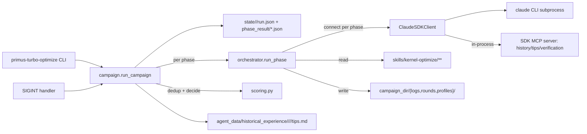
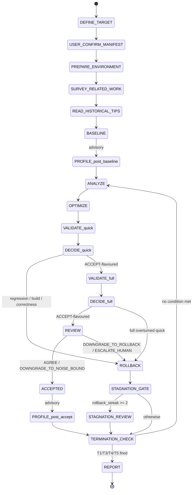

# turbo_optimize design

`primus-turbo-optimize` is the long-running CLI that drives the
`kernel-optimize` skill in `agent_workspace/Primus-Turbo/agent/skills/kernel-optimize/`
end-to-end. The skill describes a multi-phase optimization loop intended
to be run by Claude under human supervision; this package wraps that
loop so an operator can launch one campaign, walk away, and come back
to a finished optimization on a `optimize/<campaign_id>` git branch.

## Goals and non-goals

### Goals

- One prompt opens a campaign, exactly one human checkpoint
  (`manifest.yaml` confirmation), then unattended execution until
  TERMINATION_CHECK or `Ctrl+C`.
- Every accept/rollback decision is taken by Python from parsed
  benchmark CSVs, not by the LLM. Hard rules from
  `workflow/optimize-loop.md` (Scoring Operations) and
  `rules/iteration_rules.mdc` (iteration rules) are encoded once in
  `scoring.py`.
- Resume-after-crash works at phase granularity. Internal phase outputs
  live on disk as JSON; `-s <campaign_id>` reloads them and re-enters
  the state machine at the right node.
- Cross-campaign knowledge transfer through a single `tips.md` knowledge
  base under `agent_data/historical_experience/<gpu>/<op>/<backend>/`,
  written only at REPORT to keep noise low.

### Non-goals (v1)

- Multi-LLM orchestration. Only Anthropic Claude via `claude-agent-sdk`.
- `execution_mode=workspace`. The orchestrator rejects manifests with
  `execution_mode=workspace` after MANIFEST_CONFIRM.
- Sub-agent fan-out inside a single phase. `run_phase` accepts an
  `agents=` kwarg as an extension seam, but every phase currently runs
  one sequential `ClaudeSDKClient`.

## High-level architecture



Three boundaries to keep in mind:

1. **Python orchestrator vs Claude session.** The Python process owns
   the state machine, decision logic, and filesystem layout. Each phase
   spins up a fresh `ClaudeSDKClient`, runs Claude with a phase-scoped
   tool whitelist, and waits for Claude to write a structured JSON file
   that Python then loads. Claude never sees the next phase's prompt.
2. **`claude` CLI subprocess.** The SDK launches `claude --print` as a
   child process; `ClaudeAgentOptions.cwd` pins its current directory
   to `params.workspace_root`. All paths the orchestrator hands to
   prompts are absolutized at campaign start so the two cwds (Python
   shell vs Claude subprocess) cannot disagree.
3. **In-process MCP server.** History queries, tips read/write, and
   benchmark CSV parsing are exposed as MCP tools to Claude through
   `create_sdk_mcp_server` (see `turbo_optimize/mcp/__init__.py`). The
   tools share the live `CampaignParams` object with the Python side,
   so they always resolve relative paths against the current campaign.

## Directory layout

```
turbo_optimize/
├── __init__.py / __main__.py
├── cli.py                              # argparse, --cleanup-stray short-circuit
├── config.py                           # CampaignParams + PHASE_TIMEOUT_DEFAULTS
├── errors.py                           # Phase{Idle,Wall}Timeout, PhaseExpectedOutputMissing
├── manifest.py                         # read/write/confirm manifest.yaml
├── state.py                            # RunState, atomic run.json writer, phase_result_path
├── signals.py                          # SIGINT double-tap, GracefulStop
├── skills.py                           # skill-section + workspace-hygiene rendering
├── logs.py                             # append-only optimize.md, performance_trend.md, cost.md
├── scoring.py                          # CSV parse, geomean, accept/rollback, REVIEW signals
├── model_connnector/
│   └── claude_code_connector.py        # ClaudeAgentOptions wrapper, IS_SANDBOX detection
├── orchestrator/
│   ├── campaign.py                     # main state machine (~2 300 LOC)
│   ├── run_phase.py                    # generic phase runner (timeouts, wrap-up recovery)
│   ├── cleanup.py                      # --cleanup-stray implementation
│   ├── warm_restart.py                 # writes <campaign_dir>/warm_restart.sh
│   └── phases/
│       ├── define_target.py
│       ├── prepare_environment.py
│       ├── survey_related_work.py
│       ├── read_historical_tips.py
│       ├── baseline.py
│       ├── profile.py
│       ├── analyze.py
│       ├── optimize.py
│       ├── validate.py
│       ├── review.py
│       ├── stagnation_review.py
│       └── report.py
├── mcp/
│   ├── __init__.py                     # build_in_process_server
│   ├── history.py                      # list_ineffective_directions / query_trend / read_best_summary
│   ├── tips.py                         # query_tips / append_tip (fcntl-locked)
│   └── verification.py                 # run_quick_validation / parse_bench_csv
└── prompts/                            # f-string-templated phase prompts
```

## CLI contract

`primus-turbo-optimize` is registered in `pyproject.toml` as a
`console_scripts` entry pointing at `turbo_optimize.cli:main`.

| Flag | Role |
|---|---|
| `-p / --prompt` | Natural-language goal; opens a new campaign. Mutually exclusive with `-s` and `--cleanup-stray`. |
| `-s / --campaign <id>` | Resume an existing campaign id (the directory name under `<workspace_root>/agent/workspace/`). |
| `--cleanup-stray <id> [--apply]` | Move untracked top-level files in `workspace_root` into `<campaign_dir>/_stray/<timestamp>/`. Dry-run by default. |
| `--workspace-root` | Passed to `ClaudeAgentOptions.cwd`; parent of `agent/workspace/<campaign_id>/`. |
| `--skills-root` | Where the `skills/` and `rules/` trees live. Default: `agent_workspace/Primus-Turbo/agent`. |
| `--state-dir` | Parent for per-campaign state. The orchestrator nests every campaign under `<state_dir>/<campaign_id>/`. |
| `--model` | Anthropic model id. Default `claude-opus-4-7` (`config.MODEL_FALLBACK`). |
| `--effort` | `low` / `medium` / `high` / `max`. Default `max`. |
| `--max-iterations N` | Hard cap, must be in `(0, 120)`. Overrides any value Claude wrote into `manifest.yaml`. |
| `--max-duration <Nh\|Nm>` | Wall-clock cap. |
| `--debug-retry N` | Retry budget for build / correctness bugs (default 3, `0` disables). |
| `--base-branch BRANCH` | Override the branch every OPTIMIZE commit descends from. |
| `--dry-run` | Print the phase plan and exit; no Claude session. |
| `-v / --verbose` | Extra `-v` drops log level from INFO to DEBUG. |

`--prompt`, `--campaign`, and `--cleanup-stray` form a mutually
exclusive `argparse` group. `_run_cleanup` short-circuits before
`CampaignParams` is constructed because cleanup mode does not need a
prompt or a Claude session.

`CampaignParams` is the only object passed between the CLI, the
orchestrator, and the MCP server. It is built once from the CLI flags
and merged with `manifest.yaml` after the user confirms the draft (see
`config.CampaignParams.merge_manifest`).

## Phase state machine

`turbo_optimize/state.py:PHASE_ORDER` enumerates the linear sequence of
phases the orchestrator visits. The actual control flow is *not* a
simple linear walk; the round body cycles through ANALYZE / PROFILE /
OPTIMIZE / VALIDATE / REVIEW / DECIDE, and rollback streaks divert into
STAGNATION_REVIEW.



PROFILE is treated as advisory: when `rocprofv3` is not on `PATH`, or
the profile_command throws, the orchestrator logs a WARNING and keeps
going. Three triggers exist: `post_baseline`, `post_accept`, and
`pre_stagnation`.

## Phase responsibilities

Each phase is a thin module under `orchestrator/phases/`. Every phase
has the same contract:

1. Load its prompt template from `turbo_optimize/prompts/<phase>.md`.
2. Render it with f-string variables (campaign metadata, history,
   target paths).
3. Call `run_phase(...)` with phase name, allowed_tools whitelist, MCP
   servers (when needed), and the `expected_output` JSON path.
4. Return the loaded structured result to the orchestrator.

Allowed-tool whitelists (`orchestrator/phases/*.ALLOWED_TOOLS`) are
deliberately narrow:

| Phase | Allowed tools (plus MCP where listed) |
|---|---|
| DEFINE_TARGET | `Read, Write, Glob, Grep` |
| PREPARE_ENVIRONMENT | `Read, Write, Edit, Bash`, plus the in-process MCP for verification |
| SURVEY_RELATED_WORK | `Read, Write, WebFetch, WebSearch, Bash(git:*)` |
| READ_HISTORICAL_TIPS | `Read` + MCP `query_tips` |
| BASELINE | `Read, Write, Edit, Bash, Glob, Grep` + MCP verification |
| PROFILE | `Read, Write, Bash, Glob, Grep` |
| ANALYZE | `Read, Write, Glob, Grep, Bash(rocprof*:*), Bash(python:*)` + MCP history/tips |
| OPTIMIZE | `Read, Edit, Write, Glob, Grep, Bash(cp/mkdir/python/make/cmake/pip:*)` |
| VALIDATE | `Read, Write, Bash, Glob` + MCP verification |
| REVIEW | `Read, Write` + MCP history/tips |
| STAGNATION_REVIEW | same as ANALYZE |
| REPORT | `Read, Write, Glob` + MCP `append_tip` |

## `run_phase` skeleton

`orchestrator/run_phase.py` is the single place where every phase's
ClaudeSDKClient session is set up. It wraps four concerns the phase
runners would otherwise duplicate:

- **Cache reuse.** When `expected_output` already exists and parses,
  `run_phase` skips the Claude session and replays the JSON directly.
  Used by `-s <id>` resume so a phase that already wrote its result is
  not re-billed. `force=True` overrides this for OPTIMIZE retry and
  ANALYZE retry-hint, where the previous JSON is intentionally stale.
- **Streaming with timeouts.** Each phase has an idle (silence between
  two adjacent SDK messages) and a wall (entire phase including
  retries) budget; defaults live in
  `config.PHASE_TIMEOUT_DEFAULTS`. `run_phase` wraps the message stream
  in `asyncio.wait_for` for the wall budget and tracks per-message
  inactivity for the idle budget. On timeout it raises `PhaseIdleTimeout`
  / `PhaseWallTimeout`; retriable phases (per `retries` and
  `retriable` flags) get one more attempt.
- **Wrap-up recovery.** Some Claude sessions close cleanly without
  having written `expected_output` (observed at round-7 OPTIMIZE in the
  reference campaign). `run_phase` then fires one extra "wrap-up"
  session with a narrow prompt: "stop, inspect the workspace, emit the
  JSON, exit". The wrap-up has its own wall budget
  (`WRAP_UP_WALL_TIMEOUT_S = 600s`) and is bookkept as a separate
  `cost.md` row tagged `wrap_up`.
- **Cost accounting.** Every attempt appends one row to
  `<campaign_dir>/logs/cost.md` with phase, round, status (`ok` /
  `cached` / `interrupted` / `error:*`), wall seconds, SDK seconds,
  turn count, and USD cost. Status `cached` represents reuse hits;
  resume picks up `Cumulative USD` from the last row.

`run_phase` is intentionally generic (`agents=`, `extra_tools=`,
`mcp_servers=`) so a future plan-(c) upgrade ("phase fan-out into Task
sub-agents") needs no signature change.

## CampaignParams and configuration

`config.CampaignParams` is a dataclass that aggregates:

- The CLI inputs (`prompt`, `workspace_root`, `skills_root`, `state_dir`,
  `model`, `effort`, `max_iterations`, `max_duration`, `debug_retry`,
  `base_branch`, `dry_run`).
- The campaign identifier (`campaign_id`, `campaign_dir`,
  `tips_root`).
- Manifest-derived target metadata (`target_op`, `target_backend`,
  `target_lang`, `target_gpu`, `execution_mode`, `primary_metric`,
  `representative_shapes`, `kernel_source`, `test_command`,
  `benchmark_command`, `quick_command`, `profile_command`).

Three resolution rules carry surprising semantics:

- **`merge_manifest`.** Called after MANIFEST_CONFIRM. Manifest values
  win except when the CLI override is non-empty for `max_iterations` /
  `max_duration` / `base_branch`. Authoritative target metadata
  (`target_op`, `target_backend`, `target_gpu`, `execution_mode`, …)
  always takes the manifest value to keep the prompt and the CSV parser
  consistent.
- **`resolve_runtime_defaults`.** Fills `model` / `effort` from CLI
  flag → resumed `run.json` → `MODEL_FALLBACK` / `EFFORT_FALLBACK`. The
  resolved values are written back into `state.params` so a subsequent
  resume without flags reuses the same model.
- **`resolved_tips_root`.** Returns the absolute knowledge-base path,
  using `TURBO_TIPS_ROOT` when set, else
  `<tool_repo>/agent_data/historical_experience`. The path is
  intentionally outside `workspace_root` because `_git_rollback` runs
  `git clean -fd` inside `workspace_root` and would otherwise erase
  `tips.md`.

`PHASE_TIMEOUT_DEFAULTS` is sized off observed worst cases on the
benchmark rigs. The sizing model is

```
idle >= 1.5 * worst_single_silent_subtask + stream_keepalive_slack
wall >= P95 * 1.7 across all retries
```

`get_phase_timeouts(phase, phase_variant)` looks up
`"PHASE (variant)"` first, then `"PHASE"`, then a conservative
fallback. VALIDATE has separate quick / full entries because the work
envelopes differ ~5x.

## State persistence

Two groups of files live under `state_dir = <state_root>/<campaign_id>/`:

- `run.json` — the single mutable snapshot.
  ```json
  {
    "campaign_id": "...",
    "campaign_dir": "...",
    "params": { ... CampaignParams.to_dict() ... },
    "current_phase": "ANALYZE",
    "current_round": 4,
    "best_round": 3,
    "best_score": {"Forward TFLOPS": 318.6},
    "rollback_streak": 0,
    "started_at": "2026-04-20 09:14",
    "last_update": "2026-04-20 12:37",
    "history": [{ "round": 1, "decision": "BASELINE", "score": {...}, ... }, ...]
  }
  ```
  Written atomically (temp file + `os.replace`) after every phase
  transition.
- `phase_result/<phase>[_round<N>][_<suffix>].json` — structured
  per-phase output. The phase prompt instructs Claude to `Write` the
  file at this exact path. VALIDATE writes two files per round
  (`validate_round<N>_quick.json` and `..._full.json`); PROFILE writes
  one per trigger (`profile_round<N>_post_baseline.json`, …).

State namespacing prevents concurrent-campaign clobbering. The CLI
default `--state-dir state` becomes `state/<campaign_id>/` after
`_namespace_state_dir`. Two migrators run on startup so warm restarts
of older trees still work:

1. `_migrate_legacy_state` moves a top-level `state/run.json` into
   `state/<id>/` when the legacy file's `campaign_id` matches.
2. `_migrate_stray_phase_results` rescues phase JSONs that an older run
   wrote to `<workspace_root>/state/phase_result/` (Claude cwd) and
   moves them to the orchestrator's namespaced location.

## Manifest confirmation flow

Hand-off to the user is the only point in the campaign where execution
blocks on stdin. Two modes (`turbo_optimize/manifest.py`):

- **TTY interactive.** Print a manifest summary, validate it,
  and prompt `y` (accept) / `e` (open `$EDITOR`) / `n` (abort).
- **Non-TTY unattended.** Print a hint that points the operator at
  `manifest.confirmed` (one-line `ok` triggers acceptance) and
  `manifest.canceled` (any content aborts), then poll the campaign dir
  every 2 s.

`is_already_confirmed` short-circuits MANIFEST_CONFIRM on resume, so
`-s <id>` after a successful confirmation never re-blocks. The required
manifest fields are listed in `manifest.REQUIRED_FIELDS`; `git_commit`
and `git_branch` were *removed* from that tuple after the orchestrator
started force-applying its own values (see `FORCED_GIT_COMMIT` /
`FORCED_GIT_BRANCH` below).

## ACCEPT / ROLLBACK decision

All decisions are made by `scoring.decide_accept_rollback`. The rules
combine `optimize-loop.md` "Scoring Operations Specification" with
`iteration_rules.mdc` Rule 3:

1. Build failed or correctness failed → ROLLBACK (reasons:
   `"build failed"`, `"correctness failed (...)"`, `"benchmark Check=FAIL ..."`).
2. Per-shape regression > 3% on a primary metric → ROLLBACK with
   `"core shape regressed N%"`. Worst regression ≥ 5% surfaces the
   harder reason.
3. Aggregate regression for any primary metric → ROLLBACK with
   `"aggregate <metric> regressed vs current best"`.
4. No metric improved → ROLLBACK with `"no metric improved over current best"`.
5. Best improvement < `max(2%, observed_noise * 2)` → `ACCEPT_PENDING_NOISE`.
6. Otherwise → ACCEPTED.

Two practical extensions on top of the base spec:

- **Full-validation gate.** `optimize-loop.md` lets `quick` short-circuit
  acceptance; the orchestrator instead always re-validates with
  `validation_level="full"` whenever quick was ACCEPT-flavoured. The
  full result is authoritative; if it overturns the quick decision,
  `state.history` records `"ROLLED BACK"` and `verified_ineffective`
  gains the failed direction.
- **REVIEW phase.** After a full ACCEPT, REVIEW collates the quick and
  full score vectors, compares against the manifest's primary metrics,
  and produces one of four verdicts (`AGREE`,
  `DOWNGRADE_TO_NOISE_BOUND`, `DOWNGRADE_TO_ROLLBACK`,
  `ESCALATE_HUMAN`). In tolerant mode (the only mode wired up in v1)
  only the three hard rules — hypothesis-metric alignment, off-target
  gain, correctness bit-identity — can downgrade an ACCEPT.
  `_apply_review_verdict` translates the verdict into a possibly
  mutated `DecisionResult`.

`debug_retry` adds a micro-loop on top of OPTIMIZE+VALIDATE: when the
first attempt's failure reason is `"build failed"`, `"correctness failed"`,
or `"benchmark Check=FAIL"`, the orchestrator builds a `<retry_context>`
markdown block (attempt number, failure category, log paths, failing
shapes) and re-invokes OPTIMIZE+VALIDATE with `force=True`. Score
regressions and "no improvement" verdicts are not retryable — they
indicate the hypothesis itself is the problem.

## Git policy

Two module-level constants in `orchestrator/campaign.py` are not
configurable through the CLI or manifest:

- `FORCED_GIT_COMMIT = True` — every ACCEPTED round commits onto the
  `optimize/<campaign_id>` branch with a templated commit message
  (`[optimize] <op> <backend> round-<N>: <hypothesis>`).
- `FORCED_GIT_BRANCH = "auto"` — PREPARE_ENVIRONMENT creates the
  optimize branch off `base_branch` so the user's source branch never
  accumulates throwaway commits.

Rationale: rollback uses `git reset --hard HEAD` + `git clean -fd` +
`git submodule update --recursive` + a recursive `submodule foreach`
that resets and cleans every submodule. The plain file-copy path
(`_rollback_kernel`) only restores the single `kernel_source` file,
cannot delete files added during the failed round, and corrupts on
deeply nested writes — exactly the residue observed on the campaigns
that motivated the policy. The git path is the canonical one; the
file-copy path is a fallback when git is missing.

`_enforce_base_branch_gate` after PREPARE_ENVIRONMENT rejects the
campaign when the working tree is not on the expected branch or is
dirty. Because `FORCED_GIT_COMMIT` is true, the workspace-clean
requirement is unconditional.

## Logs

Three append-only markdown logs live under
`<campaign_dir>/logs/`:

- **`optimize.md`** — primary structured log. Sections include
  `Baseline`, `Optimization History` (one `### round-N` block per
  decision), `Current Best`, `Directions to Try`, `Verified Ineffective
  Directions`, `Final Report`, `Termination Check`. Editors in
  `logs.py` insert into the right `## ` section instead of EOF
  appending so dedup parsers find their data.
- **`performance_trend.md`** — one row per round, columns: `Round`,
  `Status`, `Description`, `Fwd Avg/Peak TFLOPS`, `Bwd Avg/Peak
  TFLOPS`, `Step Geomean TFLOPS`, `vs Baseline`, `Key Finding`. Used
  by the viewer's perf chart and by ANALYZE prompt history injection.
- **`cost.md`** — one row per `run_phase` call. Columns: `Time`,
  `Phase`, `Round`, `Status`, `Wall s`, `SDK s`, `Turns`, `Cost USD`,
  `Cumulative USD`. Resume picks up `Cumulative USD` from the last row.

`logs.extract_history` re-parses these files into structured Python
objects (`history_rows`, `verified_ineffective`, `directions_to_try`,
`current_best_round`, `current_best_score`) for prompt injection.

## In-process MCP server

`mcp/__init__.py:build_in_process_server(params)` returns a
`create_sdk_mcp_server`-built server bound to a `CampaignContext`
closure (campaign_dir, workspace_root, tips_root, target metadata).
Tools are mounted on `ClaudeAgentOptions.mcp_servers={"turbo": server}`
in every phase that needs them, and the allow-list contributions come
from `mcp.mcp_allowed_tools()`.

| Tool | Reads / writes | Used by |
|---|---|---|
| `list_ineffective_directions` | reads `optimize.md` | ANALYZE, STAGNATION_REVIEW |
| `query_trend` | reads `performance_trend.md` | ANALYZE, STAGNATION_REVIEW |
| `read_best_summary` | reads the best round's `summary.md` | ANALYZE, OPTIMIZE |
| `query_tips` | reads `tips.md` under `tips_root` | READ_HISTORICAL_TIPS, ANALYZE |
| `append_tip` | writes `tips.md` (fcntl-locked) | REPORT only |
| `run_quick_validation` | runs `manifest.quick_command` | VALIDATE, BASELINE |
| `parse_bench_csv` | parses a benchmark CSV | VALIDATE |

Two design choices worth calling out:

- The `tips.md` knowledge base is the only cross-campaign artifact.
  Quality gates ensure tips stay reusable: max 5 per campaign, four
  required fields (context / signal / takeaway / applicability), and
  Failure tips must reference profiler or benchmark signals — not
  one-off bugs.
- `_invalidate_stale_report_cache` deletes
  `state/.../phase_result/report.json` before REPORT runs on a warm
  restart whose `current_round` or `best_round` advanced past the
  cached report; otherwise `run_phase`'s cache reuse would skip
  `mcp__turbo__append_tip` and the new lessons would be lost.

## SIGINT handling

`signals.install_sigint_handler` overrides the Python SIGINT handler.
First press sets a `stop_event`; phase runners check it on every SDK
message, call `client.interrupt()`, and raise `GracefulStop`. The
campaign loop catches `GracefulStop`, jumps to REPORT, and exits with
code 0. A second SIGINT removes the override so Python's default
`KeyboardInterrupt` propagates and the process exits with 130.

The `interrupt()` call is bounded by `INTERRUPT_TIMEOUT_S = 10s`; if
it stalls, the connector's `__aexit__` wraps `disconnect` in another
`asyncio.wait_for` so a hung SDK cannot keep the campaign alive.

## Resume semantics

`load_or_init_run` returns `(state, resumed)`. On resume,
`_rewind_if_needed` rewinds mid-round phases (`OPTIMIZE` / `VALIDATE`
/ `DECIDE` / `PROFILE` / `REVIEW`) back to ANALYZE for the same
`current_round`. Round numbers stay monotonic; only the sub-phase is
reset. OPTIMIZE side effects are idempotent at the file layer because
`summary.md` and `kernel_snapshot/` are overwritten on re-run.

Special case: a campaign that already reached `DONE` is rewindable when
the new invocation raised `--max-iterations` or `--max-duration`. In
that case `_rewind_if_needed` drops back to TERMINATION_CHECK; the
next loop pass either advances to a fresh ANALYZE round or terminates
again with refreshed numbers. `_can_extend_after_done` mirrors the
T3/T4 branches of `_termination_check` to keep the rewind decision
consistent.

`warm_restart.write_script` regenerates
`<campaign_dir>/warm_restart.sh` at campaign start and at the end of
DEFINE_TARGET so the absolute paths stay current. The shell wrapper
requires `-i` and/or `-d`; reusing the previous values would
immediately re-trigger T3/T4.

## Workspace hygiene

Every phase that may create files
(`BASELINE` / `OPTIMIZE` / `VALIDATE` / `PREPARE_ENVIRONMENT`) gets a
`<workspace_hygiene>` block injected at prompt time
(`skills.render_workspace_hygiene`):

- All new files must live under `<campaign_dir>/`.
- In-place edits to tracked source files are allowed.
- Benchmark / test commands that dump CSV / log to cwd must `mv` (not
  `cp`) the artifacts into the round's `artifacts/` folder.
- Snapshotting into `kernel_snapshot/` requires a trailing slash on
  the `cp` destination.
- Before the structured result is written, `ls <workspace_root>` must
  show no new top-level files.

`--cleanup-stray <id>` (handled in `cli._run_cleanup` and
`orchestrator/cleanup.py`) is the operator escape hatch when the
hygiene rule is broken anyway: it inspects `git status --porcelain` for
top-level untracked files and moves each into
`<campaign_dir>/_stray/<timestamp>/` (dry-run unless `--apply`).

## Container root + IS_SANDBOX

Phases run with `permission_mode="bypassPermissions"`, equivalent to
`claude --dangerously-skip-permissions`. Native Claude Code refuses
that flag under root unless `IS_SANDBOX=1` is set. The
`ClaudeCodeConnector` constructor injects `IS_SANDBOX=1` into the child
env when (a) the permission mode is bypass, (b) `os.geteuid() == 0`,
and (c) the caller did not explicitly set the variable. An explicit
`export IS_SANDBOX=0` is preserved.

## Tests

`tests/optimizer/` covers the orchestrator end-to-end without ever
contacting Claude or running a GPU. The two flagship tests are:

- `test_smoke_orchestrator.py:test_dry_run_plan` — `--dry-run` prints
  the phase plan and creates `<campaign_dir>/`.
- `test_smoke_orchestrator.py:test_smoke_campaign_reaches_done` —
  monkey-patches every phase's `run()` to write deterministic
  `phase_result/*.json` and walks the orchestrator from DEFINE_TARGET
  to DONE. Asserts `run.json.current_phase == DONE`,
  `manifest.yaml` exists, `optimize.md` contains `Baseline` and
  `Termination Check`, `performance_trend.md` has at least three rows
  (BASELINE + two ACCEPTED), and `cost.md` is well-formed.

Other targeted suites cover scoring (`test_full_validation_gate`,
`test_review_integration`, `test_debug_retry`, `test_rollback`,
`test_measurement_consistency`), state migration
(`test_state_namespacing`, `test_resume_rewind`,
`test_path_resolution`), CLI behaviour (`test_cli_overrides`,
`test_model_effort`, `test_phase_timeouts`), and logs / cost / tips
(`test_optimize_md_sections`, `test_cost_log`, `test_report_tips`,
`test_tips_root_and_report_cache`).

## Risks and follow-ups

- **MCP exception surface.** The in-process MCP tools share the
  orchestrator's process; an uncaught exception in a tool would crash
  the campaign. Every tool function is wrapped in `_safe(...)` which
  returns `{"content": [...], "is_error": True}` on exception.
- **Concurrent campaigns and `tips.md`.** v1 serialises appends with
  `fcntl.flock`. v2 plan: extract `mcp/*.py` behind a stdio MCP server
  so multiple `primus-turbo-optimize` processes can share one writer.
- **`execution_mode=workspace`.** Manifest field still exists for
  forward compatibility but the orchestrator currently rejects it after
  MANIFEST_CONFIRM. Resurrecting workspace mode requires the SYNC_BACK
  step from the SKILL spec to be designed.
- **Plan (c) upgrade for SURVEY / ANALYZE.** `run_phase` already
  accepts `agents=` and `extra_tools=["Task"]`, so opting into
  sub-agent fan-out for one phase is a per-phase flag flip rather than
  an architecture change.
