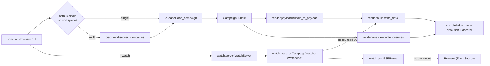

# turbo_view design

`primus-turbo-view` turns the on-disk artifacts produced by
`primus-turbo-optimize` into a self-contained HTML dashboard. Operators
use it to monitor a running campaign, debug a finished one, and compare
many campaigns side-by-side.

## Goals and non-goals

### Goals

- **Static-first.** The default invocation produces an `index.html` +
  `data.json` + vendored assets bundle that can be opened from disk
  without a running server.
- **Live mode.** `--watch` re-renders on filesystem changes and pushes
  reload events over Server-Sent Events so the browser refreshes
  without manual reload.
- **Multi-campaign overview.** Auto-detects whether the path is a
  single campaign or a workspace containing many; renders a top-level
  index with KPI bar + per-campaign rows that link to per-campaign
  detail pages.
- **Strict isolation from `turbo_optimize`.** No imports from
  `turbo_optimize.*`; every artifact is re-parsed from disk. The
  reader graceful-degrades on schema drift (`run.json` missing,
  `cost.md` malformed, …) so the dashboard works for older campaigns.

### Non-goals (v1)

- No write-side mutations of campaign state. The viewer is read-only.
- No authentication / TLS. `--watch` binds to `127.0.0.1` by default
  and is intended for local-laptop use only.
- No data-store. The viewer always reads the campaign tree directly;
  there is no cache layer.

## High-level architecture



Three layers under `turbo_view/`:

1. **IO** (`turbo_view/io/`). Read every artifact on disk into typed
   dataclasses defined in `model.py`.
2. **Analytics** (`turbo_view/analytics/`). Pure functions that
   transform the typed bundle into chart-ready JSON.
3. **Render** (`turbo_view/render/`). Jinja templates + vendored JS /
   CSS. Inlines the analytics JSON into a `<script id="data">` tag so
   the page is fully static.
4. **Watch** (`turbo_view/watch/`). HTTP + SSE + filesystem watcher
   that re-runs the same render pipeline on every change.

## Directory layout

```
turbo_view/
├── __init__.py / __main__.py
├── cli.py                       # argparse + auto-mode selection + watch wiring
├── discover.py                  # locate state/<id>/run.json under a root
├── model.py                     # CampaignBundle / RunState / *Row dataclasses
├── io/
│   ├── loader.py                # campaign_dir -> CampaignBundle (single entry point)
│   ├── state.py                 # parse state/<id>/run.json
│   ├── logs.py                  # parse cost.md, performance_trend.md, optimize.md sections
│   ├── rounds.py                # rounds/round-N/{summary.md, artifacts/, kernel_snapshot/}
│   ├── bench.py                 # rounds/round-N/artifacts/benchmark.csv
│   ├── profiles.py              # profiles/round-N_<flavor>/{summary.md, rocprofv3/}
│   ├── transcripts.py           # profiles/_transcript_<phase>.jsonl
│   └── markdown.py              # markdown-it-py + bleach -> sanitized HTML
├── analytics/
│   ├── cost.py                  # cumulative + per_phase + per_round + cost_per_improvement
│   ├── gantt.py                 # phase blocks + transcript event overlay
│   ├── heatmap.py               # rounds × shapes matrix with Δ% vs baseline
│   ├── profile.py               # top-N kernels, family rollup, GPU resource trends, treemap
│   └── diff.py                  # round-vs-round profile diff
├── render/
│   ├── payload.py               # CampaignBundle -> JSON dict (schema_version)
│   ├── build.py                 # write_detail (single-campaign)
│   ├── overview.py              # build_overview_payload + write_overview (multi)
│   ├── templates/               # detail.html / overview.html / panels/*.html
│   └── assets/                  # app.js, app.css, chart.umd.min.js, ...
└── watch/
    ├── server.py                # WatchServer + WatchSession + ThreadingHTTPServer handler
    ├── sse.py                   # SSEBroker + SSE wire format helpers
    └── watcher.py               # CampaignWatcher (watchdog) with 500 ms debounce
```

## CLI contract

`primus-turbo-view` is registered in `pyproject.toml` as
`turbo_view.cli:main`. Single positional argument plus a small set of
flags:

| Flag | Role |
|---|---|
| `path` | Campaign directory or workspace root. The CLI validates that the path is a directory before doing anything else. |
| `-o / --out-dir` | Output directory. Default: `<path>/view/`. |
| `--single` / `--multi` | Force single-campaign or overview mode (mutually exclusive). |
| `--watch` | Serve the dashboard and rebuild on filesystem changes. |
| `--port` | Watch HTTP port (default 8765, `0` lets the OS choose). |
| `--host` | Watch bind address (default `127.0.0.1`). |
| `--no-open` | Do not open the browser on start. |
| `-v / --verbose` | Logging verbosity (repeat for `DEBUG`). |

Mode detection (`_resolve_mode` + `_looks_like_single_campaign`):

1. `--single` / `--multi` always wins.
2. Otherwise: if `path/manifest.yaml` exists, or `path/rounds/`
   exists, or `path/state/<id>/run.json` parses, treat as a single
   campaign.
3. Otherwise call `discover_campaigns(path)`. Two-or-more campaigns
   trigger overview mode; one or zero falls back to single.

In `--watch` single mode the CLI additionally requires
`_is_valid_campaign(path)` (manifest or parseable run.json) so the
server does not start on a directory that has nothing to render.

## Data layer

### Discovery

`discover.discover_campaigns(root)` returns a `list[CampaignHandle]`
sorted by `campaign_id`. Search policy:

1. Look at `<root>/state/*/run.json` first — the canonical layout when
   the user points the viewer at one workspace.
2. Otherwise walk `<root>` BFS to depth 4 looking for any
   `state/<id>/run.json`.
3. A directory containing both `state/<id>/run.json` and
   `manifest.yaml` is treated as a valid campaign root even when only
   one of the two layouts matches.

Each `CampaignHandle` carries `campaign_id`, the campaign root
directory, the absolute `state_run_json` path, and the `mtime` of the
state file (so the overview can render "started" / "last update"
without re-reading `run.json`).

### Single-campaign load

`io.loader.load_campaign(campaign_dir)` is the single entry point. It
calls every IO module and returns a `CampaignBundle`:

```python
@dataclass(slots=True)
class CampaignBundle:
    state: RunState | None
    cost: list[CostRow]
    perf: list[PerfRow]
    rounds: dict[int, RoundBundle]
    profiles: dict[int, ProfileBundle]
    ineffective: list[dict[str, Any]]
    transcripts: dict[str, list[TranscriptEvent]]
    optimize_md_sections: dict[str, str]
```

Sources of truth, by file:

| File | Parser | Failure mode |
|---|---|---|
| `state/<id>/run.json` | `io.state.load_run_state` | Returns `None` and the loader synthesizes a fallback RunState from `cost.md` + `performance_trend.md`. |
| `logs/cost.md` | `io.logs.parse_cost_md` | Returns `[]`; cost panels render empty. |
| `logs/performance_trend.md` | `io.logs.parse_perf_trend_md` | Returns `[]`; perf chart renders empty. |
| `logs/optimize.md` | `io.logs.parse_optimize_md_sections` | Returns `{}`. |
| `rounds/round-N/summary.md` | `io.rounds._read_summary_html` (markdown-it-py + bleach) | Returns `None` per round. |
| `rounds/round-N/artifacts/benchmark.csv` | `io.bench.parse_benchmark_csv` | Returns `[]`; rejects the two rows-per-shape schema gracefully. |
| `profiles/round-N_<flavor>/profile_summary.md` | `io.profiles._read_summary_html` | Returns `None`. |
| `profiles/round-N_<flavor>/rocprofv3/<host>/<pid>_kernel_trace.csv` | `io.profiles._kernel_dispatches` | Returns `[]`. |
| `profiles/_transcript_<phase>.jsonl` | `io.transcripts.parse_transcript_file` | Skips bad lines with a WARNING. |
| `verified_ineffective.jsonl` | `io.loader._load_ineffective` | Returns `[]`; bad lines logged. |

`io.loader._synthesize_state` exists because older campaigns predate
the `run.json` writer. When `run.json` is missing it constructs a
best-effort `RunState` from `cost.md` + `performance_trend.md` so the
sticky bar still has a campaign id, current phase, started/last-update
times, and a best round. The synthesizer never fabricates a campaign
that lacks all evidence; an empty `cost` and `perf` produce `None`.

### Markdown sanitization

`io.markdown.render_markdown` is the trust boundary for everything
Claude wrote into `summary.md`. Pipeline: `markdown-it-py` (CommonMark
+ table extension, no inline HTML) → `bleach.clean` with an explicit
allow-list (`p`, `h1`-`h6`, `code`, `pre`, `blockquote`, `br`, `hr`,
`strong`, `em`, `del`, `ins`, `ul`, `ol`, `li`, table tags, `a`).
Allowed protocols are `http`, `https`, `mailto`. Any other tag /
attribute / protocol is stripped.

## Analytics layer

The analytics layer is a set of pure functions over the typed bundle,
each returning a small JSON dict. Two design rules:

- **Pure and total.** Every function tolerates empty inputs and
  missing fields by returning empty lists / `None` cells. Front-end
  panels render `—` for missing values.
- **Sanitisation upstream.** NaN / Inf are replaced with `None` once
  in `render.build._sanitize` so `JSON.parse` does not throw. Analytics
  functions can therefore use Python's natural arithmetic without
  branching for noisy data.

### Cost (`analytics/cost.py`)

- `cumulative_series` — running `cumulative_usd` for the cost line
  chart.
- `per_phase_breakdown` — sums `cost_usd` / `wall_s` / `turns`
  grouped by canonical phase name (variant suffix stripped).
- `per_round_series` — sums per round number (rows with `round=None`
  bucket into round 0).
- `cost_per_improvement` — at every ACCEPTED point, plot
  `cumulative_usd` vs best step-geomean Δ% relative to BASELINE. Used
  as a marginal-utility curve.
- `cost_panel` rolls all four into one dict, plus headline totals.
- `token_turn_wall_panel` exposes the per-round series as three
  parallel arrays for the `wall_s` / `sdk_s` / `turns` mini charts in
  panel 8.

### Gantt (`analytics/gantt.py`)

- `gantt_blocks` — one block per `CostRow` with `start_ts`, `end_ts`
  (`start_ts + wall_s`), abnormal-flag (`error:*`, `idle_timeout_*`,
  `wall_timeout`, `interrupted`), and aggregate fields (cost, turns).
- `transcript_event_overlay` — flattens debug events from every
  phase transcript (`idle_timeout`, `retry_attempt`, `wall_timeout`,
  `interrupted`).
- `gantt_panel` returns `{ "blocks": [...], "events": [...] }`.

### Heatmap (`analytics/heatmap.py`)

`heatmap_panel(rounds)` builds a (rounds × shapes) matrix of forward /
backward TFLOPS plus Δ% vs the lowest-numbered round that has bench
data. Shape ordering is "first appearance in lowest round wins";
shapes that don't appear in every round still occupy a column with
missing cells rendered as `null`.

### Profiles (`analytics/profile.py`)

Five sub-panels operate on `ProfileBundle.dispatches` (per-round
kernel-trace rows from `rocprofv3`):

- **P1 — top-N kernels** (`top_n_kernels`). Group by kernel name, sum
  `dur_us`, return the top 12 with cleaned names (`clean_name`).
- **P2 — round-over-round** (`round_over_round_topn`). Track the same
  set of kernels across rounds. Uses the intersection of each round's
  top-N to avoid sparse-line whiplash; falls back to the lowest round's
  top-N when intersection is empty.
- **P3 — family rollup** (`family_rollup`). Sum `dur_us` per family
  (`fwd_dgrad`, `wgrad`, `quant`, `amax`, `elementwise`, `other`)
  using regex rules in `_FAMILY_RULES`.
- **P4 — GPU resource trends** (`gpu_resource_trends`). Pick a target
  kernel (largest cumulative time in the lowest round when not
  specified) and trace VGPR / SGPR / LDS across rounds.
- **P9 — squarified treemap layout** (`treemap_layout`). Compute
  rectangle layouts in `[0,1] × [0,1]` so the front-end can scale to
  any pixel area.

`profile_panel_for_round(bundle)` returns the per-round panel
(top_n + treemap + summary HTML); cross-round aggregates live in
`payload._profile_global` so the page payload does not duplicate
multi-MB across 67–90-round campaigns.

### Diff (`analytics/diff.py`)

`round_diff(left, right)` produces a row-per-kernel side-by-side view
with `left_total_us` / `right_total_us` / `delta_pct`. Sorted by the
larger of the two totals so the biggest movers float to the top.

## Render layer

### Payload (`render/payload.py`)

`bundle_to_payload(bundle)` is the single conversion from typed Python
objects into a JSON-serialisable dict. The schema is versioned
(`SCHEMA_VERSION = "4"`):

```json
{
  "schema_version": "4",
  "state": { ... | null },
  "kpi_summary": {"step": {...}, "fwd": {...}, "bwd": {...}},
  "perf": [...],
  "perf_panel": {"points": [...], "accepted": [...], "baseline": ..., "best": ..., "annotations": {"accept": [...]}},
  "cost_panel": {...},
  "gantt_panel": {...},
  "heatmap_panel": {...},
  "token_turn_wall_panel": {...},
  "rounds": [...],
  "ineffective": [...],
  "profile_panels": {"<round>": {...}},
  "profile_global": {"round_over_round": {...}, "family_rollup": {...}, "resources": {...}},
  "profile_diffs": {"rounds": [...], "pairs": [...]}
}
```

Schema timeline:

- `"1"` (PR-1) — state, perf, perf_panel, rounds, ineffective,
  optimize_md_sections.
- `"2"` (PR-2) — adds cost_panel / gantt_panel / heatmap_panel /
  token_turn_wall_panel; per-round rows expose `bench_shapes`.
- `"3"` (PR-3) — adds `profile_panels` (P1/P9 per round) plus
  `profile_global` (P2/P3/P4 cross-round) and `profile_diffs` (P5
  consecutive pairs); `gantt_panel.events` populated from transcripts.
- `"4"` (post-review) — drops `optimize_md_sections` (never consumed
  by the front-end), hoists global profile aggregates out of per-round
  panels, collapses `profile_diffs` to consecutive pairs.

`_build_round_rows` merges three sources into one row per round, in
priority order: `state.history[i]` (decision / description / score /
at), `perf[i]` (fallback for description, perf numbers), and
`rounds[i]` (summary HTML, bench shapes, artifacts). The union of
round numbers across all three sources is rendered; missing fields
graceful-degrade to `None` / `""`.

### Build (`render/build.py`)

`render_detail(bundle)` is a pure function returning
`(index_html, payload)`. Three callers consume it:

- `write_detail(...)` — write to `<out_dir>/index.html` plus
  `data.json` plus per-page `assets/` (in single-campaign mode).
- `render_overview(...) → write_overview(...)` — single-campaign
  detail pages are co-emitted under `c/<id>/index.html` so the
  overview rows can link in.
- `watch.server.WatchSession.render` — exact same call paths, same
  output, just into the watch `out_dir`.

`_payload_json_for_inline` neutralises `</script>` substrings in
embedded JSON by escaping the slash. `_sanitize` recursively replaces
NaN / Inf with `None` so `JSON.parse` does not throw on the
client-side.

Asset list (vendored under `turbo_view/render/assets/`):

- `app.js` (~64 KB) — panel renderers, vanilla JS.
- `app.css` / `markdown.css`.
- `chart.umd.min.js` (Chart.js 4.x) + `chartjs-plugin-annotation.min.js`.
- `VENDOR_NOTES.md` — provenance for the vendored bundles.

The asset bundle is sourced via `Path(__file__).resolve().parent / "assets"`
so editable installs and wheel installs see the same files. A
multi-campaign overview shares one `assets/` at the top level; per-
campaign sub-pages link in with `asset_prefix="../../assets/"`.

### Templates

`render/templates/` uses Jinja2:

- `layout.html` — base layout with `<head>` + asset linking.
- `detail.html` — single-campaign page (extends layout, includes
  every panel snippet). Splits into `detail-main` (perf trend,
  profile global, cost+gantt row, heatmap, rounds table) and
  `detail-side` (verified ineffective, token/turn/wall mini, live
  tail).
- `overview.html` — multi-campaign page with the KPI bar and a sortable
  table linking to per-campaign sub-pages.
- `panels/*.html` — one `<section>` per panel, all empty wrappers.
  The renderers in `app.js` populate them after `JSON.parse`-ing the
  inlined payload.

## Overview mode

`render/overview.py:write_overview(root, out_dir)` builds a top-level
page when there are multiple campaigns:

1. `discover_campaigns(root)` returns the handles.
2. For each handle, call `load_campaign(...)` and project the bundle
   into a flat row (`_campaign_row`) carrying the campaign id, target
   metadata from `state.params`, current phase, current/best round,
   best Δ% vs baseline (`_baseline_pct`), cumulative cost, started/
   last-update timestamps, and round count.
3. Build a KPI summary across rows: active campaigns (any non-DONE
   state), total cost, total wall hours, count of campaigns updated in
   the last 24 hours.
4. Write `<out_dir>/index.html` + `data.json` + `assets/`, then walk
   the same handles writing per-campaign detail pages under
   `<out_dir>/c/<id>/index.html` with `copy_assets=False` and
   `asset_prefix="../../assets/"`.

The overview template is intentionally narrow (KPI bar + table); deep
analytics live on the per-campaign detail page.

## Watch mode

Watch mode wires four components together (`watch/server.py`):

1. **`WatchSession`** — owns `mode`, `root`, `out_dir`, the SSE
   broker, and a render lock. `render()` re-runs the offline build
   pipeline and bumps a generation counter. `on_change()` calls
   `render()` and then `broker.publish("reload", "")`; on error it
   publishes `("error", ...)` instead.
2. **`CampaignWatcher`** — `watchdog.observers.Observer` recursively
   watching `watch_dir` (defaults to `root`). `_ChangeHandler`
   filters events to mutating types (`created`, `modified`, `deleted`,
   `moved`, `closed`) only — the read-side accesses generated by the
   renderer itself would otherwise feed back into a permanent rebuild
   loop. Paths under `/view/` and `*.swp` are explicitly ignored.
3. **`_DebouncedTrigger`** — 500 ms timer that resets on every event;
   one phase typically writes `cost.md` + `run.json` + a transcript
   line within milliseconds of each other, so collapsing the burst
   into one rebuild + one `reload` is enough.
4. **HTTP handler** — extends `SimpleHTTPRequestHandler` with three
   custom routes:
   - `GET /events` — long-lived SSE stream. Emits `: connected gen=<n>`
     immediately, then forwards every `SSEEvent` from the broker. A
     keepalive comment fires every 15 s so idle proxies do not kill
     the connection.
   - `GET /tail?phase=<P>&n=<N>&campaign=<id>` — last `N` non-empty
     lines of the matching `_transcript_<P>.jsonl`. `n` clamped to
     `[1, 500]`. In multi mode the optional `campaign` hint scopes the
     `rglob` to one campaign.
   - `GET /phases?campaign=<id>` — list every transcript file under
     the relevant root with mtime + size, sorted by mtime descending.

Threading: the HTTP server is a stdlib `ThreadingHTTPServer` running
in a daemon thread; the watcher runs in its own thread; SSE
subscribers each block on a private `queue.Queue`. `BrokenPipeError`
and `ConnectionResetError` are caught everywhere so a browser navigating
away mid-stream does not dump tracebacks to stderr.

`SSEBroker` (in `watch/sse.py`) keeps subscribers in a set under a
lock. `publish` fans out to every subscriber; a full queue
(`maxsize=32`) drops the slow subscriber rather than blocking the
producer. `format_sse` writes the `event: <name>\ndata: <payload>\n\n`
wire format; `stream` is a generator that combines incoming events
with periodic keepalive comments.

The CLI (`cli._run_watch`) installs SIGINT / SIGTERM handlers to set a
`threading.Event` and call `server.stop()` from the main thread — both
the HTTP socket and the watchdog observer are closed before the
process exits so file descriptors are not leaked when watch mode is
embedded in a longer pipeline.

## Tests

`tests/view/` covers each layer in isolation plus a few integration
flows. Highlights:

- IO parsers: `test_view_io_state.py`, `test_view_io_logs.py`,
  `test_view_io_rounds.py`, `test_view_io_bench.py`,
  `test_view_io_profiles.py`, `test_view_io_transcripts.py`,
  `test_view_io_markdown.py`.
- Discovery: `test_view_discover.py` (depth-bounded BFS, dedup,
  multi-campaign root).
- Loader fallback: `test_view_io_loader.py` (synthesized RunState
  when run.json missing).
- Analytics: `test_view_analytics.py` (cost / gantt / heatmap),
  `test_view_analytics_profile.py` (P1/P2/P3/P4/P5/P9 + treemap).
- Render: `test_view_render_payload.py` (schema_version + payload
  shape), `test_view_render_build.py` (HTML + asset copy + NaN
  sanitisation), `test_view_render_overview.py` (KPI + per-campaign
  rows + sub-page links).
- Watch: `test_view_watch_sse.py` (broker fan-out, slow-subscriber
  drop), `test_view_watch_watcher.py` (debounce, mutating-event
  filter), `test_view_watch_server.py` (SSE end-to-end, `/tail` /
  `/phases` JSON).

None of the tests connect to a network service or run watchdog against
a real filesystem long enough to flake; the watcher tests fire
synthetic `FileSystemEvent` instances directly into the handler.

## Risks and follow-ups

- **Schema drift.** `payload.py` carries a `SCHEMA_VERSION` constant.
  When the front-end consumes a new field, bump the version. Older
  pages cached by a browser tab will still parse but show stale data;
  the sticky bar advertises the version so a mismatch is visible.
- **Filesystem fan-in on large campaigns.** A 90-round campaign has
  several thousand files. The renderer is fast on laptop-class disks
  (low single-digit seconds for the full render), but the watch
  observer issues one event per file write. The 500 ms debounce keeps
  the rebuild count linear in user-visible state changes; if it ever
  becomes a bottleneck, the watcher could narrow its scope to
  `logs/`, `rounds/`, `profiles/` instead of the whole campaign tree.
- **`bleach` allow-list drift.** `markdown.py` is the only XSS
  boundary. Any future panel that renders Claude-authored text must
  go through `render_markdown`. A direct `markdown_it().render(...)`
  call without `bleach.clean` is a security bug.
- **Multi-campaign asset reuse.** The overview emits one `assets/`
  at the top level. If a future panel wants per-campaign assets, the
  shared-prefix trick in `write_detail` will need a deeper change.
